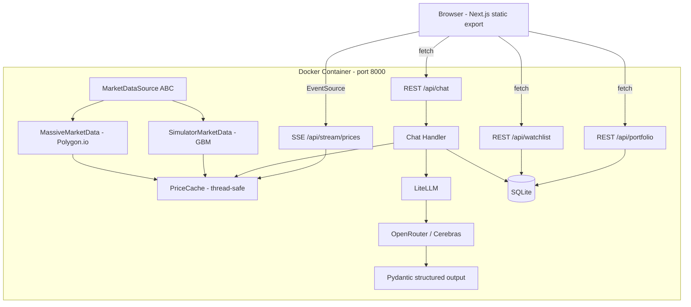

# FinAlly — AI Trading Workstation

A Bloomberg-inspired AI-powered trading workstation with live streaming market data, simulated portfolio trading, and an LLM assistant that can analyze positions and execute trades via natural language.

Built as a capstone project demonstrating **multi-agent AI development** — the entire codebase was produced by orchestrated coding agents working from a shared specification.

## Features

- **Live price streaming** via SSE with green/red flash animations and sparkline charts
- **Simulated portfolio** — $10k virtual cash, market orders, instant fills
- **Portfolio visualizations** — treemap heatmap, P&L chart, positions table
- **AI chat assistant** — analyzes holdings, suggests and auto-executes trades via natural language
- **Dual market data** — built-in GBM price simulator (default) or real Polygon.io data (optional)
- **Dark terminal aesthetic** — data-dense, desktop-first layout

## Tech Stack

| Layer | Technology |
|---|---|
| **Backend** | Python 3.12, FastAPI, uvicorn, asyncio |
| **Data streaming** | Server-Sent Events (SSE) — one-way push, native `EventSource` |
| **AI / LLM** | LiteLLM → OpenRouter → Cerebras inference (`gpt-oss-120b`) |
| **Structured outputs** | Pydantic v2 models enforcing LLM response schema |
| **Market simulation** | Geometric Brownian Motion (GBM) with sector correlation + shock events |
| **Database** | SQLite, lazy-initialized from `.sql` schema/seed files |
| **Package management** | `uv` (Python), `npm` (Node) |
| **Frontend** | Next.js 15 (static export), TypeScript, Tailwind CSS |
| **Charting** | TradingView Lightweight Charts (canvas-based, handles real-time load) |
| **Testing** | pytest (118 unit tests), Playwright (20 E2E tests) |
| **Container** | Docker multi-stage build (Node → Python), single port 8000 |

## Architecture



**Key design decisions:**
- **SSE over WebSockets** — one-way push is sufficient; simpler, no bidirectional overhead
- **Strategy pattern** for market data — `SimulatorMarketData` and `MassiveMarketData` share an ABC; all downstream code is source-agnostic
- **Static Next.js export served by FastAPI** — single origin, no CORS, one port, one container
- **SQLite** — single-user workstation needs no database server; self-contained, zero config
- **Structured LLM outputs** — Pydantic model enforces the response schema so trade execution is safe to automate

## AI Features (in the product)

The chat assistant is a full **agentic loop** — not just Q&A:

1. On each message, the backend injects live portfolio state as context (cash, positions with P&L, watchlist prices, total value)
2. The LLM responds with structured JSON (`message`, `trades[]`, `watchlist_changes[]`)
3. The backend auto-executes any trades or watchlist changes specified in the response
4. Each trade goes through the same validation as manual trades (cash/share checks)
5. Partial success is handled — if trade 1 succeeds and trade 2 fails, both outcomes are reported
6. Conversation history (last 20 messages) is persisted in SQLite and included in every call

**Mock mode** (`LLM_MOCK=true`) returns deterministic responses — used for all E2E tests, enabling fast CI without an API key.

## Built with AI Agents

The codebase was built entirely by **orchestrated coding agents** using a planning-first methodology:

```
planning/PLAN.md          ← shared spec (the agent contract)
planning/MARKET_DATA_SUMMARY.md  ← handoff doc between agents
CLAUDE.md                 ← agent instructions + context injection
```

**Agent team and build order:**

| Agent | Responsibility |
|---|---|
| Market Data Agent | GBM simulator, Massive API client, abstract interface, SSE endpoint, 55 tests |
| Backend Agent | Database layer, portfolio/watchlist/chat API routes, LLM integration |
| Frontend Agent | Next.js app, SSE connection, all UI components, TradingView charts |
| Docker Agent | Multi-stage Dockerfile, docker-compose, start/stop scripts |
| E2E Agent | Playwright test suite, docker-compose.test.yml |

**AI development techniques demonstrated:**

- **Specification-driven development** — complete system spec written in `PLAN.md` before any code; agents read this as the shared contract
- **Planning files as coordination mechanism** — agents communicate via files in `planning/`; each agent's output becomes the next agent's input context
- **Context injection via `CLAUDE.md`** — project instructions and spec are injected into every agent session automatically
- **Skill-driven execution** — specialized skills (`cerebras`, `frontend-design`, `test-driven-development`) loaded per task to enforce consistent patterns
- **Review-fix loop** — each component went through a code review agent that produced a findings doc; a separate agent applied the fixes
- **Mock mode by design** — `LLM_MOCK=true` was built into the spec from the start to enable deterministic E2E testing without API keys

## Quick Start

```bash
# Configure
cp .env.example .env
# Add your OPENROUTER_API_KEY to .env

# Run with Docker (macOS/Linux)
./scripts/start_mac.sh

# Or directly
docker compose up --build

# Open http://localhost:8000
```

To stop: `./scripts/stop_mac.sh` or `docker compose down`

Windows: use `scripts/start_windows.ps1` / `scripts/stop_windows.ps1`

## Environment Variables

| Variable | Required | Description |
|---|---|---|
| `OPENROUTER_API_KEY` | Yes | OpenRouter key for AI chat (get one at openrouter.ai) |
| `MASSIVE_API_KEY` | No | Polygon.io key for real market data; omit to use the built-in simulator |
| `LLM_MOCK` | No | Set `true` for deterministic mock LLM responses (used in E2E tests) |
| `DATABASE_PATH` | No | SQLite path; defaults to `../db/finally.db` relative to backend |

## Testing

```bash
# Backend unit tests (118 tests)
cd backend && uv run pytest

# E2E Playwright tests (20 tests)
cd test && npm install && npx playwright test
```

## Project Structure

```
finally/
├── frontend/               # Next.js static export (TypeScript, Tailwind CSS)
│   ├── app/                # Next.js app router (layout, page)
│   ├── components/         # UI components (Watchlist, ChatPanel, Heatmap, etc.)
│   └── lib/                # API client, types, SSE hook, formatters
├── backend/                # FastAPI uv project (Python 3.12)
│   ├── src/
│   │   ├── market/         # GBM simulator, Massive client, abstract interface, SSE
│   │   ├── database/       # SQLite layer (schema, queries, lazy init)
│   │   ├── llm/            # LLM chat handler, Pydantic models, prompt builder, mock
│   │   ├── routes/         # API endpoints (portfolio, watchlist, chat, health)
│   │   └── app.py          # FastAPI application + lifespan
│   ├── db/                 # schema.sql + seed.sql (executed on first run)
│   └── tests/              # pytest unit tests (118 tests, 7 modules)
├── test/                   # Playwright E2E tests (20 tests)
├── scripts/                # Docker start/stop (macOS + Windows)
├── planning/               # Agent coordination docs (spec, summaries, archive)
└── db/                     # Volume mount point — SQLite written here at runtime
```
